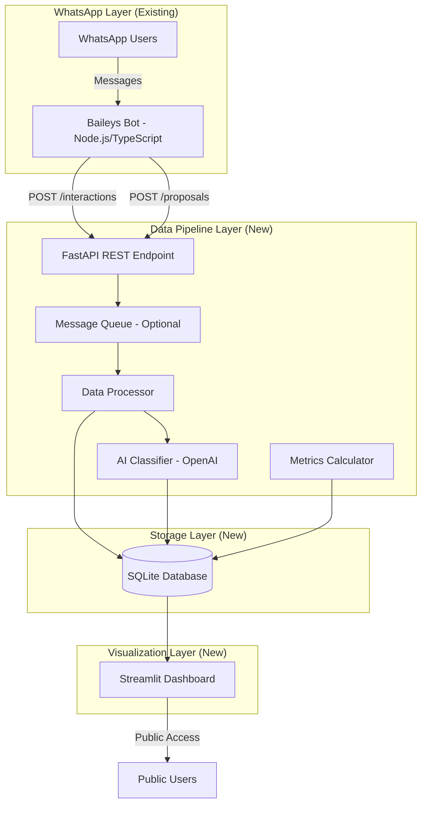

# Design Document

## Overview

O Voz.Local Pipeline é um sistema de dados completo que conecta três componentes principais:

1. **Bot WhatsApp (Baileys)** - já implementado em TypeScript/Node.js, captura interações dos cidadãos
2. **Pipeline de Dados Python** - processa, classifica e armazena dados usando IA
3. **Dashboard Streamlit** - visualiza métricas de accountability e lacunas legislativas

O design integra o fluxo agêntico existente (que já faz web-scraping de PLs) com uma nova camada de persistência em SQLite e um dashboard público. O sistema opera de forma assíncrona, com o bot Node.js enviando dados para o pipeline Python via API REST ou fila de mensagens.

## Architecture

### High-Level Architecture



### Technology Stack

**Existing Components:**
- Bot WhatsApp: Node.js + TypeScript + Baileys
- Database: PostgreSQL (Prisma ORM)

**New Components:**
- Pipeline Backend: Python 3.11+ with FastAPI
- AI Classification: OpenAI API (GPT-4)
- Database: SQLite (para desenvolvimento rápido, migração futura para PostgreSQL)
- Dashboard: Streamlit
- Package Management: uv + venv
- Data Processing: Pandas, SQLAlchemy

### Integration Strategy

O bot Node.js existente será modificado minimamente para enviar dados ao pipeline Python via HTTP POST. O pipeline Python será independente e poderá ser executado em paralelo.

## Components and Interfaces

### 1. FastAPI REST Endpoints

**Base URL:** `http://localhost:8000/api/v1`

#### POST /interactions
Recebe interações dos cidadãos (opiniões sobre PLs)

```python
# Request Body
{
    "cidadao_id": "hash_telefone_123",
    "pl_id": "PL_2024_001",
    "tipo_interacao": "opiniao",  # opiniao | visualizacao | reacao
    "opiniao": "a_favor",  # a_favor | contra | pular | null
    "conteudo": "Texto opcional da interação",
    "metadata": {
        "cidade": "São Paulo",
        "grupo_inclusao": "Mulheres",
        "timestamp": "2024-01-15T10:30:00Z"
    }
}

# Response
{
    "status": "success",
    "interacao_id": "int_123",
    "message": "Interação registrada com sucesso"
}
```

#### POST /proposals
Recebe propostas de pauta dos cidadãos

```python
# Request Body
{
    "cidadao_id": "hash_telefone_123",
    "conteudo": "Precisamos de mais creches no bairro X",
    "tipo_conteudo": "texto",  # texto | audio_transcrito
    "audio_url": "https://...",  # opcional
    "metadata": {
        "cidade": "São Paulo",
        "grupo_inclusao": "Mulheres",
        "timestamp": "2024-01-15T10:30:00Z"
    }
}

# Response
{
    "status": "success",
    "proposta_id": "prop_123",
    "tema_classificado": "Educação",
    "confidence_score": 0.92,
    "message": "Proposta registrada e classificada"
}
```

#### GET /metrics/lacuna
Retorna métricas de lacuna legislativa calculadas

```python
# Response
{
    "lacunas_por_tema": [
        {
            "tema": "Saúde",
            "demandas_cidadaos": 150,
            "pls_tramitacao": 12,
            "percentual_lacuna": 92.0,
            "classificacao": "Alta Lacuna"
        }
    ],
    "lacunas_por_grupo": [...],
    "lacunas_por_cidade": [...]
}
```

### 2. Data Processor Component

Responsável por validar, enriquecer e persistir dados.

```python
class DataProcessor:
    def __init__(self, db_session, ai_classifier):
        self.db = db_session
        self.classifier = ai_classifier
    
    async def process_interaction(self, interaction_data: dict) -> InteractionModel:
        """Valida e persiste interação no banco"""
        pass
    
    async def process_proposal(self, proposal_data: dict) -> ProposalModel:
        """Classifica tema e persiste proposta"""
        pass
    
    def detect_duplicates(self, proposal: ProposalModel) -> List[ProposalModel]:
        """Detecta propostas similares usando embeddings"""
        pass
```

### 3. AI Classifier Component

Usa OpenAI para classificar temas de propostas de pauta.

```python
class AIClassifier:
    TEMAS = [
        "Saúde", "Educação", "Transporte", "Segurança",
        "Meio Ambiente", "Habitação", "Cultura", "Esporte",
        "Assistência Social", "Infraestrutura", "Outros"
    ]
    
    async def classify_theme(self, conteudo: str) -> ClassificationResult:
        """
        Classifica o tema de uma proposta de pauta
        
        Returns:
            ClassificationResult com tema_principal, temas_secundarios, confidence_score
        """
        pass
    
    async def detect_similarity(self, proposal1: str, proposal2: str) -> float:
        """Calcula similaridade semântica entre duas propostas"""
        pass
```

### 4. Metrics Calculator Component

Calcula a Métrica de Lacuna Legislativa.

```python
class MetricsCalculator:
    def calculate_lacuna_by_theme(self) -> List[LacunaMetric]:
        """
        Compara volume de propostas cidadãs vs PLs em tramitação por tema
        
        Lacuna = (demandas_cidadaos - pls_tramitacao) / demandas_cidadaos * 100
        """
        pass
    
    def calculate_lacuna_by_group(self) -> List[LacunaMetric]:
        """Calcula lacuna segmentada por grupo de inclusão"""
        pass
    
    def calculate_lacuna_by_city(self) -> List[LacunaMetric]:
        """Calcula lacuna segmentada por cidade"""
        pass
```

### 5. Streamlit Dashboard Component

Interface pública de visualização.

**Páginas:**
- Home: KPIs gerais (cidadãos engajados, opiniões, propostas)
- Lacunas Legislativas: Gráficos de lacuna por tema, grupo, cidade
- Propostas Populares: Tabela de propostas mais recorrentes
- Mapa de Engajamento: Visualização geográfica

## Data Models

### SQLite Schema

```sql
-- Tabela de Cidadãos
CREATE TABLE cidadaos (
    id INTEGER PRIMARY KEY AUTOINCREMENT,
    telefone_hash TEXT UNIQUE NOT NULL,
    cidade TEXT NOT NULL,
    grupo_inclusao TEXT,  -- Mulheres, PCDs, LGBTQIA+, etc.
    temas_interesse TEXT,  -- JSON array
    created_at TIMESTAMP DEFAULT CURRENT_TIMESTAMP,
    updated_at TIMESTAMP DEFAULT CURRENT_TIMESTAMP
);

-- Tabela de Projetos de Lei
CREATE TABLE projetos_lei (
    id INTEGER PRIMARY KEY AUTOINCREMENT,
    pl_id TEXT UNIQUE NOT NULL,  -- Identificador externo do PL
    titulo TEXT NOT NULL,
    resumo TEXT,
    tema_principal TEXT NOT NULL,
    temas_secundarios TEXT,  -- JSON array
    cidade TEXT,
    status TEXT,  -- tramitacao, aprovado, rejeitado
    url_fonte TEXT,
    created_at TIMESTAMP DEFAULT CURRENT_TIMESTAMP
);

-- Tabela de Interações
CREATE TABLE interacoes (
    id INTEGER PRIMARY KEY AUTOINCREMENT,
    cidadao_id INTEGER NOT NULL,
    pl_id INTEGER,
    tipo_interacao TEXT NOT NULL,  -- opiniao, visualizacao, reacao
    opiniao TEXT,  -- a_favor, contra, pular
    conteudo TEXT,
    metadata TEXT,  -- JSON com dados adicionais
    timestamp TIMESTAMP NOT NULL,
    created_at TIMESTAMP DEFAULT CURRENT_TIMESTAMP,
    FOREIGN KEY (cidadao_id) REFERENCES cidadaos(id),
    FOREIGN KEY (pl_id) REFERENCES projetos_lei(id)
);

-- Tabela de Propostas de Pauta
CREATE TABLE propostas_pauta (
    id INTEGER PRIMARY KEY AUTOINCREMENT,
    cidadao_id INTEGER NOT NULL,
    conteudo TEXT NOT NULL,
    tipo_conteudo TEXT NOT NULL,  -- texto, audio_transcrito
    audio_url TEXT,
    tema_principal TEXT,
    temas_secundarios TEXT,  -- JSON array
    confidence_score REAL,
    cidade TEXT NOT NULL,
    grupo_inclusao TEXT,
    status TEXT DEFAULT 'pendente',  -- pendente, revisao_manual, aprovada
    grupo_duplicatas INTEGER,  -- ID do grupo de propostas similares
    timestamp TIMESTAMP NOT NULL,
    created_at TIMESTAMP DEFAULT CURRENT_TIMESTAMP,
    FOREIGN KEY (cidadao_id) REFERENCES cidadaos(id)
);

-- Tabela de Métricas de Lacuna (cache calculado)
CREATE TABLE metricas_lacuna (
    id INTEGER PRIMARY KEY AUTOINCREMENT,
    tipo_segmentacao TEXT NOT NULL,  -- tema, grupo, cidade
    chave_segmentacao TEXT NOT NULL,  -- valor específico (ex: "Saúde", "Mulheres", "São Paulo")
    demandas_cidadaos INTEGER NOT NULL,
    pls_tramitacao INTEGER NOT NULL,
    percentual_lacuna REAL NOT NULL,
    classificacao_lacuna TEXT NOT NULL,  -- Alta, Média, Baixa
    calculated_at TIMESTAMP DEFAULT CURRENT_TIMESTAMP,
    UNIQUE(tipo_segmentacao, chave_segmentacao)
);

-- Índices para performance
CREATE INDEX idx_interacoes_cidadao ON interacoes(cidadao_id);
CREATE INDEX idx_interacoes_pl ON interacoes(pl_id);
CREATE INDEX idx_interacoes_timestamp ON interacoes(timestamp);
CREATE INDEX idx_propostas_tema ON propostas_pauta(tema_principal);
CREATE INDEX idx_propostas_cidade ON propostas_pauta(cidade);
CREATE INDEX idx_propostas_grupo ON propostas_pauta(grupo_inclusao);
CREATE INDEX idx_propostas_timestamp ON propostas_pauta(timestamp);
```

### SQLAlchemy Models

```python
from sqlalchemy import Column, Integer, String, Text, Float, DateTime, ForeignKey
from sqlalchemy.ext.declarative import declarative_base
from sqlalchemy.orm import relationship
from datetime import datetime

Base = declarative_base()

class Cidadao(Base):
    __tablename__ = 'cidadaos'
    
    id = Column(Integer, primary_key=True)
    telefone_hash = Column(String(255), unique=True, nullable=False)
    cidade = Column(String(100), nullable=False)
    grupo_inclusao = Column(String(50))
    temas_interesse = Column(Text)  # JSON
    created_at = Column(DateTime, default=datetime.utcnow)
    updated_at = Column(DateTime, default=datetime.utcnow, onupdate=datetime.utcnow)
    
    interacoes = relationship("Interacao", back_populates="cidadao")
    propostas = relationship("PropostaPauta", back_populates="cidadao")

class ProjetoLei(Base):
    __tablename__ = 'projetos_lei'
    
    id = Column(Integer, primary_key=True)
    pl_id = Column(String(100), unique=True, nullable=False)
    titulo = Column(String(500), nullable=False)
    resumo = Column(Text)
    tema_principal = Column(String(100), nullable=False)
    temas_secundarios = Column(Text)  # JSON
    cidade = Column(String(100))
    status = Column(String(50))
    url_fonte = Column(String(500))
    created_at = Column(DateTime, default=datetime.utcnow)
    
    interacoes = relationship("Interacao", back_populates="projeto_lei")

class Interacao(Base):
    __tablename__ = 'interacoes'
    
    id = Column(Integer, primary_key=True)
    cidadao_id = Column(Integer, ForeignKey('cidadaos.id'), nullable=False)
    pl_id = Column(Integer, ForeignKey('projetos_lei.id'))
    tipo_interacao = Column(String(50), nullable=False)
    opiniao = Column(String(20))
    conteudo = Column(Text)
    metadata = Column(Text)  # JSON
    timestamp = Column(DateTime, nullable=False)
    created_at = Column(DateTime, default=datetime.utcnow)
    
    cidadao = relationship("Cidadao", back_populates="interacoes")
    projeto_lei = relationship("ProjetoLei", back_populates="interacoes")

class PropostaPauta(Base):
    __tablename__ = 'propostas_pauta'
    
    id = Column(Integer, primary_key=True)
    cidadao_id = Column(Integer, ForeignKey('cidadaos.id'), nullable=False)
    conteudo = Column(Text, nullable=False)
    tipo_conteudo = Column(String(50), nullable=False)
    audio_url = Column(String(500))
    tema_principal = Column(String(100))
    temas_secundarios = Column(Text)  # JSON
    confidence_score = Column(Float)
    cidade = Column(String(100), nullable=False)
    grupo_inclusao = Column(String(50))
    status = Column(String(50), default='pendente')
    grupo_duplicatas = Column(Integer)
    timestamp = Column(DateTime, nullable=False)
    created_at = Column(DateTime, default=datetime.utcnow)
    
    cidadao = relationship("Cidadao", back_populates="propostas")

class MetricaLacuna(Base):
    __tablename__ = 'metricas_lacuna'
    
    id = Column(Integer, primary_key=True)
    tipo_segmentacao = Column(String(50), nullable=False)
    chave_segmentacao = Column(String(100), nullable=False)
    demandas_cidadaos = Column(Integer, nullable=False)
    pls_tramitacao = Column(Integer, nullable=False)
    percentual_lacuna = Column(Float, nullable=False)
    classificacao_lacuna = Column(String(20), nullable=False)
    calculated_at = Column(DateTime, default=datetime.utcnow)
```


## Correctness Properties

*A property is a characteristic or behavior that should hold true across all valid executions of a system-essentially, a formal statement about what the system should do. Properties serve as the bridge between human-readable specifications and machine-verifiable correctness guarantees.*

### Property Reflection

Após análise do prework, identifiquei que muitas propriedades relacionadas ao registro de opiniões (2.1, 2.2, 2.3) podem ser consolidadas em uma única propriedade mais abrangente. Similarmente, propriedades de retry (1.5, 4.3, 7.2) compartilham a mesma lógica e podem ser testadas de forma unificada. Propriedades de schema (9.1-9.4) são exemplos específicos que serão testados uma vez durante inicialização.

### Data Persistence Properties

Property 1: Interaction persistence completeness
*For any* interaction data with required fields (cidadao_id, tipo_interacao, timestamp), persisting it to the database should result in a record containing all provided fields
**Validates: Requirements 4.1**

Property 2: Concurrent interaction persistence
*For any* set of interactions submitted simultaneously, all interactions should be persisted without data loss
**Validates: Requirements 4.2**

Property 3: Citizen data completeness
*For any* citizen record, when stored in the database it should include cidade, grupo_inclusao, and temas_interesse fields
**Validates: Requirements 4.4**

Property 4: Referential integrity enforcement
*For any* attempt to insert an interaction with an invalid cidadao_id or pl_id, the database should reject the insertion
**Validates: Requirements 9.5**

### Opinion Capture Properties

Property 5: Opinion registration with metadata
*For any* citizen opinion (a_favor, contra, pular) on a PL, the system should register the opinion with timestamp, PL_id, and the citizen's grupo_inclusao
**Validates: Requirements 2.1, 2.2, 2.3, 2.5**

Property 6: Reaction capture and association
*For any* emoji reaction to a PL, the system should capture the reaction type and associate it with the correct PL_id
**Validates: Requirements 2.4**

Property 7: PL visualization tracking
*For any* PL viewed by a citizen, the system should mark that specific PL as visualized for that specific citizen
**Validates: Requirements 1.4**

### Proposal Classification Properties

Property 8: Automatic theme classification
*For any* captured proposal, the system should assign a valid theme from the predefined list (Saúde, Educação, Transporte, etc.)
**Validates: Requirements 3.3, 10.1**

Property 9: Classification confidence scoring
*For any* classified proposal, the system should include a confidence score between 0.0 and 1.0
**Validates: Requirements 10.2**

Property 10: Low confidence flagging
*For any* proposal with confidence score below 0.6, the system should mark the proposal status as 'revisao_manual'
**Validates: Requirements 10.3**

Property 11: Proposal metadata association
*For any* captured proposal, the system should associate it with the citizen's cidade and grupo_inclusao
**Validates: Requirements 3.4**

Property 12: Audio proposal dual storage
*For any* audio proposal, the system should store both the audio_url and the transcribed text in the conteudo field
**Validates: Requirements 3.2**

Property 13: Duplicate proposal grouping
*For any* two proposals with semantic similarity above 0.85, the system should assign them the same grupo_duplicatas identifier
**Validates: Requirements 3.5, 10.4**

Property 14: Multi-theme classification
*For any* classified proposal, the system should include both tema_principal and temas_secundarios (which may be empty)
**Validates: Requirements 10.5**

### Metrics Calculation Properties

Property 15: Lacuna calculation formula
*For any* theme with N citizen demands and M PLs in tramitação, the calculated lacuna should equal ((N - M) / N * 100) when N > 0
**Validates: Requirements 5.3**

Property 16: High lacuna classification
*For any* theme with lacuna percentage >= 70%, the system should classify it as "Alta Lacuna Legislativa"
**Validates: Requirements 5.4**

Property 17: Demand counting by theme and region
*For any* theme and city combination, the system should count all proposals matching both criteria
**Validates: Requirements 5.1**

Property 18: PL counting by theme and region
*For any* theme and city combination, the system should count all PLs with status 'tramitacao' matching both criteria
**Validates: Requirements 5.2**

Property 19: Lacuna segmentation by inclusion group
*For any* calculated lacuna metric, the system should provide segmentation by grupo_inclusao
**Validates: Requirements 5.5**

Property 20: Dashboard proposal ordering
*For any* list of proposals displayed on the dashboard, proposals should be ordered by frequency count in descending order
**Validates: Requirements 6.4**

### Resilience Properties

Property 21: Retry with exponential backoff
*For any* temporary failure, the system should retry exactly 3 times with exponentially increasing delays (e.g., 1s, 2s, 4s)
**Validates: Requirements 1.5, 4.3, 7.2**

Property 22: Error logging completeness
*For any* pipeline failure, the system should log an entry containing error type, timestamp, component name, and stack trace
**Validates: Requirements 7.1**

Property 23: Critical error notification
*For any* permanent failure (after 3 retries), the system should log an entry with level 'CRITICAL'
**Validates: Requirements 7.3**

Property 24: Queue persistence on database unavailability
*For any* interaction received when the database is unavailable, the system should store it in a temporary queue
**Validates: Requirements 4.5**

Property 25: Queue processing after recovery
*For any* system restart with pending items in the temporary queue, all queued items should be processed and persisted
**Validates: Requirements 7.4**

Property 26: Corrupted data isolation
*For any* batch of data containing corrupted records, the system should persist valid records and isolate corrupted ones without stopping processing
**Validates: Requirements 7.5**

### Security and Privacy Properties

Property 27: PII encryption at rest
*For any* citizen record stored in the database, the telefone_hash field should be encrypted using AES-256
**Validates: Requirements 8.1**

Property 28: Dashboard anonymization
*For any* data displayed on the public dashboard, no telefone_hash or direct citizen identifiers should be visible
**Validates: Requirements 8.3**

Property 29: Log PII exclusion
*For any* log entry generated by the system, it should not contain telefone_hash or other PII fields
**Validates: Requirements 8.4**

Property 30: Access audit trail
*For any* database query accessing citizen data, an audit log entry should be created with timestamp and query type
**Validates: Requirements 8.5**

## Error Handling

### Error Categories

1. **Validation Errors** - Invalid input data (missing required fields, invalid formats)
2. **Database Errors** - Connection failures, constraint violations, timeouts
3. **External Service Errors** - OpenAI API failures, network timeouts
4. **Processing Errors** - Classification failures, duplicate detection errors

### Error Handling Strategy

```python
class ErrorHandler:
    def __init__(self):
        self.retry_config = {
            'max_attempts': 3,
            'backoff_base': 1.0,  # seconds
            'backoff_multiplier': 2.0
        }
    
    async def handle_with_retry(self, operation, error_types=(Exception,)):
        """
        Executes operation with exponential backoff retry
        
        Retry delays: 1s, 2s, 4s
        """
        for attempt in range(self.retry_config['max_attempts']):
            try:
                return await operation()
            except error_types as e:
                if attempt == self.retry_config['max_attempts'] - 1:
                    logger.critical(f"Permanent failure after {attempt + 1} attempts: {e}")
                    raise
                
                delay = self.retry_config['backoff_base'] * (self.retry_config['backoff_multiplier'] ** attempt)
                logger.warning(f"Attempt {attempt + 1} failed, retrying in {delay}s: {e}")
                await asyncio.sleep(delay)
    
    def handle_validation_error(self, error: ValidationError):
        """Log validation errors and return 400 response"""
        logger.error(f"Validation error: {error.details}")
        return {"status": "error", "message": "Invalid input", "details": error.details}
    
    def handle_database_error(self, error: DatabaseError):
        """Handle database errors with queue fallback"""
        logger.error(f"Database error: {error}")
        # Store in temporary queue
        self.queue_manager.enqueue(error.operation_data)
        return {"status": "queued", "message": "Database unavailable, operation queued"}
```

### Temporary Queue Implementation

```python
import json
from pathlib import Path
from datetime import datetime

class TemporaryQueue:
    def __init__(self, queue_file='data/temp_queue.jsonl'):
        self.queue_file = Path(queue_file)
        self.queue_file.parent.mkdir(exist_ok=True)
    
    def enqueue(self, data: dict):
        """Append data to queue file"""
        with open(self.queue_file, 'a') as f:
            entry = {
                'data': data,
                'queued_at': datetime.utcnow().isoformat(),
                'attempts': 0
            }
            f.write(json.dumps(entry) + '\n')
    
    def process_queue(self, processor):
        """Process all queued items"""
        if not self.queue_file.exists():
            return
        
        processed = []
        failed = []
        
        with open(self.queue_file, 'r') as f:
            for line in f:
                entry = json.loads(line)
                try:
                    processor(entry['data'])
                    processed.append(entry)
                except Exception as e:
                    logger.error(f"Failed to process queued item: {e}")
                    entry['attempts'] += 1
                    if entry['attempts'] < 3:
                        failed.append(entry)
        
        # Rewrite queue with only failed items
        with open(self.queue_file, 'w') as f:
            for entry in failed:
                f.write(json.dumps(entry) + '\n')
        
        logger.info(f"Processed {len(processed)} queued items, {len(failed)} remain")
```

## Testing Strategy

### Dual Testing Approach

O sistema será testado usando duas abordagens complementares:

1. **Unit Tests** - Verificam comportamentos específicos, casos extremos e integrações
2. **Property-Based Tests** - Verificam propriedades universais através de múltiplas execuções com dados gerados

### Property-Based Testing Framework

**Framework:** Hypothesis (Python)
**Configuration:** Mínimo de 100 iterações por teste

Cada teste de propriedade deve:
- Ser anotado com comentário referenciando a propriedade do design: `# Feature: voz-local-pipeline, Property X: <description>`
- Usar geradores inteligentes que produzem dados válidos dentro do domínio esperado
- Verificar a propriedade universal, não casos específicos

### Unit Testing Framework

**Framework:** pytest
**Coverage Target:** 80% de cobertura de código

Unit tests devem focar em:
- Casos extremos (strings vazias, valores nulos, listas vazias)
- Integrações entre componentes (API → Processor → Database)
- Comportamentos específicos de erro

### Test Structure

```
tests/
├── unit/
│   ├── test_api_endpoints.py
│   ├── test_data_processor.py
│   ├── test_ai_classifier.py
│   ├── test_metrics_calculator.py
│   └── test_error_handler.py
├── property/
│   ├── test_persistence_properties.py
│   ├── test_classification_properties.py
│   ├── test_metrics_properties.py
│   ├── test_resilience_properties.py
│   └── test_security_properties.py
├── integration/
│   ├── test_end_to_end_flow.py
│   └── test_dashboard_integration.py
└── conftest.py  # Shared fixtures
```

### Example Property Test

```python
from hypothesis import given, strategies as st
import hypothesis

# Feature: voz-local-pipeline, Property 5: Opinion registration with metadata
@given(
    opiniao=st.sampled_from(['a_favor', 'contra', 'pular']),
    cidadao_id=st.integers(min_value=1, max_value=10000),
    pl_id=st.integers(min_value=1, max_value=1000),
    grupo_inclusao=st.sampled_from(['Mulheres', 'PCDs', 'LGBTQIA+', 'Idosos'])
)
@hypothesis.settings(max_examples=100)
def test_opinion_registration_includes_metadata(opiniao, cidadao_id, pl_id, grupo_inclusao):
    """Property: All opinions should be registered with timestamp, PL_id, and grupo_inclusao"""
    # Setup
    processor = DataProcessor(db_session, ai_classifier)
    
    # Execute
    interaction_data = {
        'cidadao_id': cidadao_id,
        'pl_id': pl_id,
        'tipo_interacao': 'opiniao',
        'opiniao': opiniao,
        'metadata': {'grupo_inclusao': grupo_inclusao}
    }
    result = processor.process_interaction(interaction_data)
    
    # Verify property
    assert result.cidadao_id == cidadao_id
    assert result.pl_id == pl_id
    assert result.opiniao == opiniao
    assert result.timestamp is not None
    assert json.loads(result.metadata)['grupo_inclusao'] == grupo_inclusao
```

### Example Unit Test

```python
def test_api_endpoint_returns_400_for_missing_required_fields():
    """Unit test: API should reject requests missing required fields"""
    response = client.post('/api/v1/interactions', json={
        'cidadao_id': 123
        # Missing tipo_interacao, timestamp
    })
    
    assert response.status_code == 400
    assert 'tipo_interacao' in response.json()['details']
```

## Implementation Notes

### Environment Setup

```bash
# Create virtual environment with uv
uv venv .venv
source .venv/bin/activate  # Windows: .venv\Scripts\activate

# Install dependencies
uv pip install fastapi uvicorn sqlalchemy hypothesis pytest pandas streamlit openai python-dotenv
```

### Project Structure

```
voz-local-pipeline/
├── .venv/                    # Virtual environment (uv)
├── data/
│   ├── voz_local.db         # SQLite database
│   └── temp_queue.jsonl     # Temporary queue for resilience
├── src/
│   ├── api/
│   │   ├── __init__.py
│   │   ├── main.py          # FastAPI app
│   │   └── endpoints.py     # API routes
│   ├── core/
│   │   ├── __init__.py
│   │   ├── processor.py     # DataProcessor
│   │   ├── classifier.py    # AIClassifier
│   │   ├── calculator.py    # MetricsCalculator
│   │   └── error_handler.py # ErrorHandler
│   ├── models/
│   │   ├── __init__.py
│   │   └── database.py      # SQLAlchemy models
│   ├── dashboard/
│   │   ├── __init__.py
│   │   ├── app.py           # Streamlit app
│   │   └── components.py    # Dashboard components
│   └── utils/
│       ├── __init__.py
│       ├── queue.py         # TemporaryQueue
│       └── crypto.py        # Encryption utilities
├── tests/                    # Test structure as defined above
├── .env.example
├── requirements.txt
└── README.md
```

### Configuration

```python
# .env.example
DATABASE_URL=sqlite:///data/voz_local.db
OPENAI_API_KEY=sk-...
LOG_LEVEL=INFO
RETRY_MAX_ATTEMPTS=3
RETRY_BACKOFF_BASE=1.0
ENCRYPTION_KEY=<generate-with-fernet>
DASHBOARD_UPDATE_INTERVAL=5  # seconds
```

### Database Initialization

```python
from sqlalchemy import create_engine
from models.database import Base

def init_database(database_url: str):
    """Initialize SQLite database with schema"""
    engine = create_engine(database_url)
    Base.metadata.create_all(engine)
    logger.info("Database initialized successfully")
```

### Integration with Existing Bot

O bot Node.js existente precisará fazer chamadas HTTP para o pipeline Python:

```typescript
// src/services/pipeline.service.ts
import axios from 'axios';

const PIPELINE_API_URL = process.env.PIPELINE_API_URL || 'http://localhost:8000/api/v1';

export async function sendInteractionToPipeline(interaction: Interaction) {
  try {
    const response = await axios.post(`${PIPELINE_API_URL}/interactions`, {
      cidadao_id: interaction.cidadaoId,
      pl_id: interaction.plId,
      tipo_interacao: interaction.tipo,
      opiniao: interaction.opiniao,
      conteudo: interaction.conteudo,
      metadata: {
        cidade: interaction.cidade,
        grupo_inclusao: interaction.grupoInclusao,
        timestamp: new Date().toISOString()
      }
    });
    
    return response.data;
  } catch (error) {
    console.error('Failed to send interaction to pipeline:', error);
    // Bot continues working even if pipeline is down
  }
}
```

### Dashboard Deployment

O dashboard Streamlit será executado como um processo separado:

```bash
# Run dashboard
streamlit run src/dashboard/app.py --server.port 8501
```

### Performance Considerations

1. **Database Indexing** - Índices já definidos no schema para queries frequentes
2. **Caching** - Métricas de lacuna são calculadas e cacheadas na tabela `metricas_lacuna`
3. **Batch Processing** - Propostas similares são detectadas em batches para eficiência
4. **Async Operations** - FastAPI com async/await para operações I/O

### Security Considerations

1. **Encryption** - Usar Fernet (symmetric encryption) para telefone_hash
2. **TLS** - Configurar certificados SSL para produção
3. **Rate Limiting** - Implementar rate limiting no FastAPI
4. **Input Validation** - Pydantic models para validação automática
5. **SQL Injection Prevention** - SQLAlchemy ORM previne SQL injection

